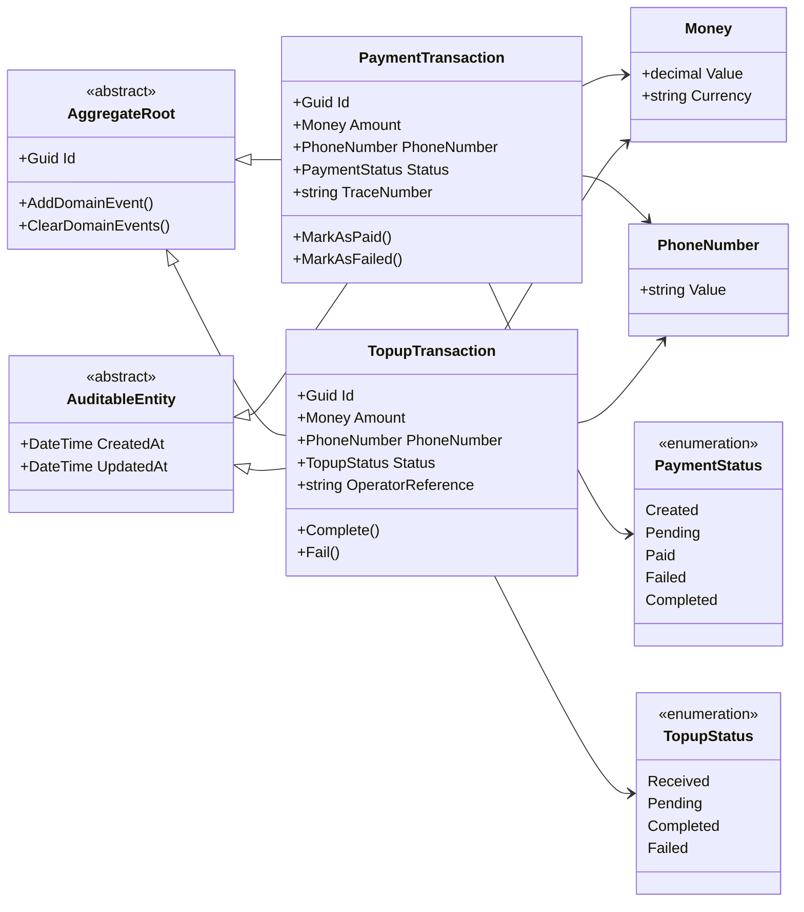

# Domain Class Diagram

## Overview

This class diagram illustrates the core domain model of the PSP platform.

The domain follows Domain-Driven Design (DDD) principles and separates business entities from infrastructure concerns.

---

## Class Diagram

---

## Description

### PaymentTransaction

Represents a payment initiated by a POS terminal.

---

### TopupTransaction

Represents a mobile recharge transaction after a successful payment.

---

### Money

A Value Object representing monetary values.

---

### PhoneNumber

A Value Object representing a valid mobile phone number.

---

### Enumerations

PaymentStatus and TopupStatus define the lifecycle of transactions.

---

## Design Principles

- Domain Driven Design
- Rich Domain Model
- Aggregate Root
- Value Objects
- Strongly Typed Domain
