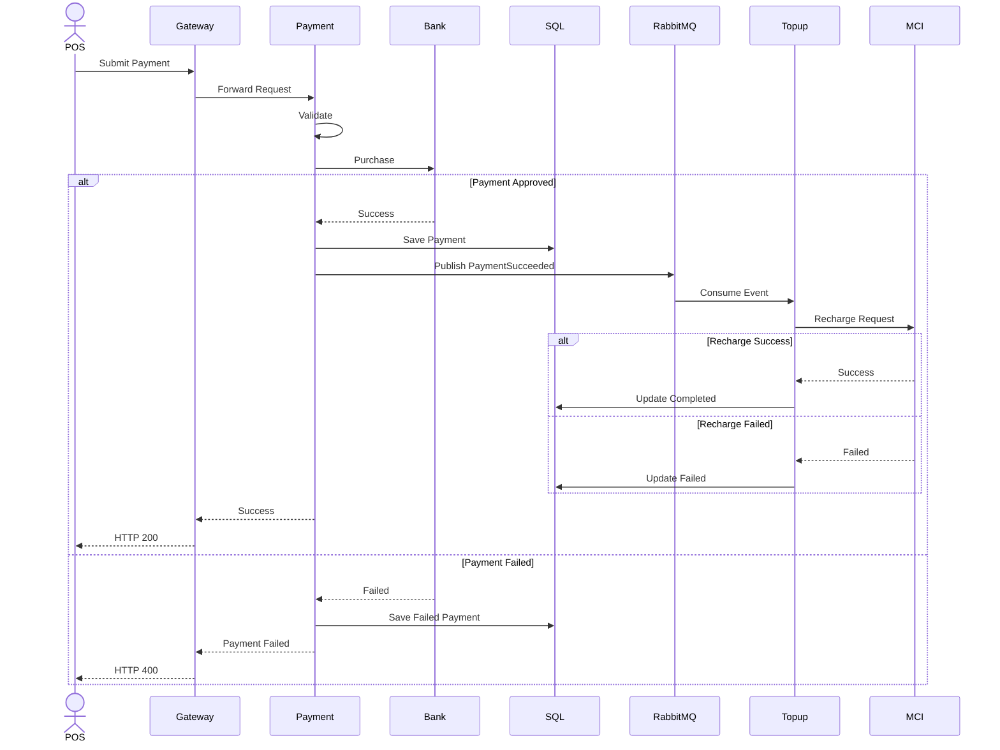

# End-to-End Payment & Top-up Flow

## Overview

This diagram represents the complete business flow across all services.

---

---

## Business Flow

1. POS submits payment.
2. Gateway forwards the request.
3. Payment validates the request.
4. Bank authorizes or rejects the payment.
5. On success, Payment stores the transaction and publishes an event.
6. Topup consumes the event.
7. Topup calls the Mobile Operator.
8. Recharge status is updated.
9. Final state is persisted.
