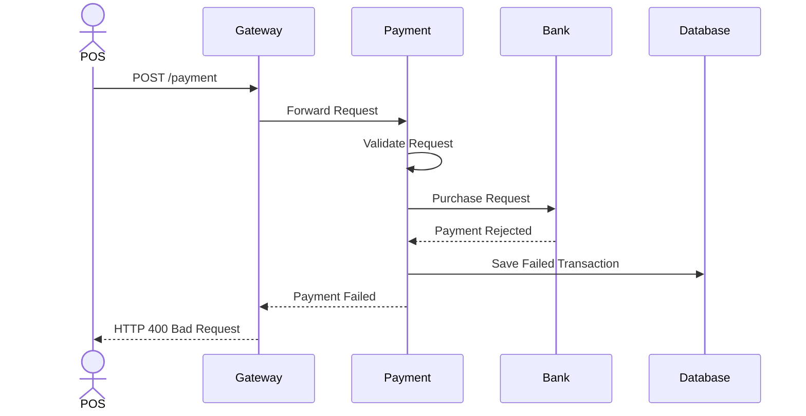

# Payment Failed Sequence

## Overview

Payment is rejected by the Bank.

---

```mermaid
sequenceDiagram

    actor POS

    participant Gateway
    participant Payment
    participant Bank
    participant Database

    POS->>Gateway: POST /payment

    Gateway->>Payment: Forward Request

    Payment->>Payment: Validate Request

    Payment->>Bank: Purchase Request

    Bank-->>Payment: Payment Rejected

    Payment->>Database: Save Failed Transaction

    Payment-->>Gateway: Payment Failed

    Gateway-->>POS: HTTP 400 Bad Request
```

---

## Result

- Payment Failed
- No Event Published
- Failed Status Stored
