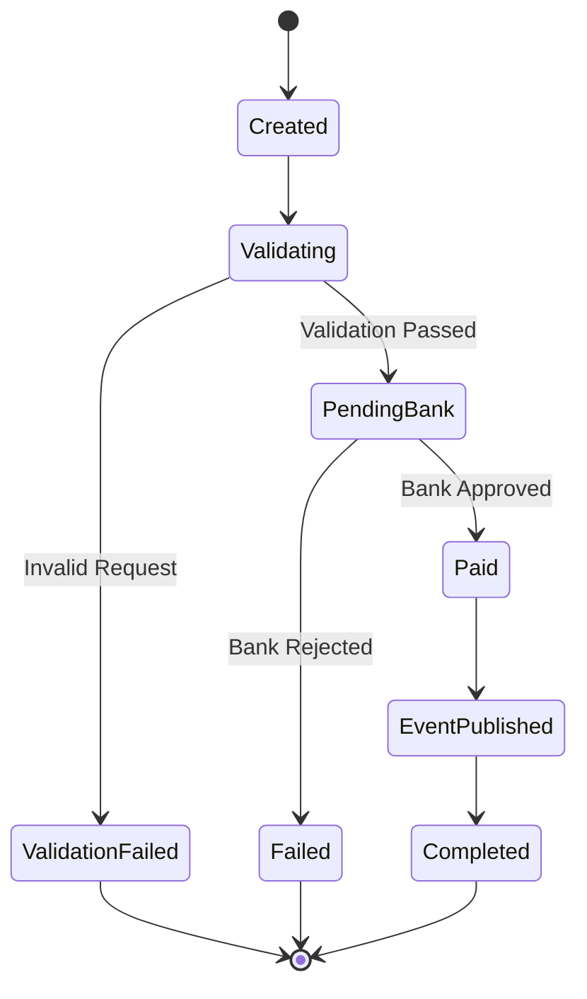

# Payment State Machine

## Overview

This state machine represents the lifecycle of a payment transaction within the PSP platform.

A payment starts in the **Created** state and transitions through different states depending on validation and bank authorization.

---

## State Diagram

---

## State Description

| State | Description |
|--------|-------------|
| Created | Payment request has been received. |
| Validating | Request validation is in progress. |
| ValidationFailed | Request validation failed. |
| PendingBank | Waiting for bank authorization. |
| Paid | Bank approved the payment. |
| EventPublished | PaymentSucceeded event has been published. |
| Completed | Payment workflow completed successfully. |
| Failed | Payment failed due to bank rejection. |

---

## Business Rules

- Every payment starts in the **Created** state.
- Invalid requests never reach the bank.
- Only successful payments publish integration events.
- Failed payments terminate the workflow.
