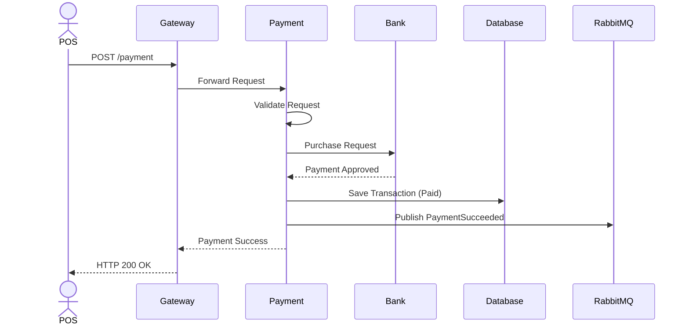

# Payment Success Sequence

## Overview

This sequence diagram illustrates the successful payment workflow.

---

---

## Result

- Payment Approved
- Transaction Stored
- Event Published
- Response Returned
