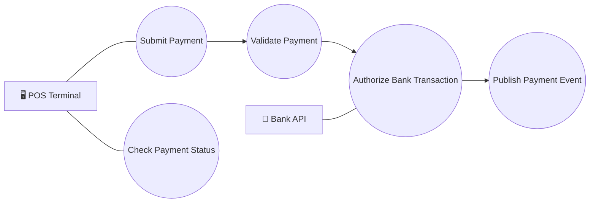

# Payment Use Case

## Overview

This diagram describes the primary payment capabilities exposed by the PSP platform.

The Payment Service is responsible for validating requests, communicating with the Bank API and publishing payment events.

---

---

## Description

The payment workflow begins when the POS submits a payment request.

The Payment Service validates the request and forwards it to the external Bank API.

If the transaction is approved, a payment event is published for downstream services.
