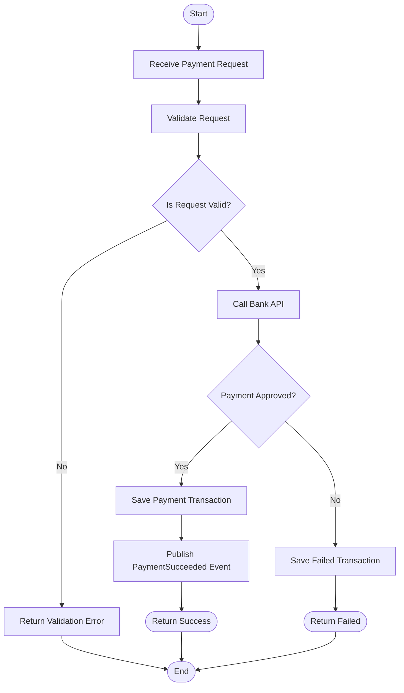

# Payment Activity Diagram

## Overview

This activity diagram illustrates the business workflow of the Payment Service.

The process starts when the POS submits a payment request and ends after the payment result is returned.

---

## Activity Diagram

---

## Business Rules

- Every request must be validated.
- Invalid requests never reach the Bank API.
- Successful payments are stored in the database.
- A successful payment publishes an integration event.
- Failed payments are persisted with a Failed status.
