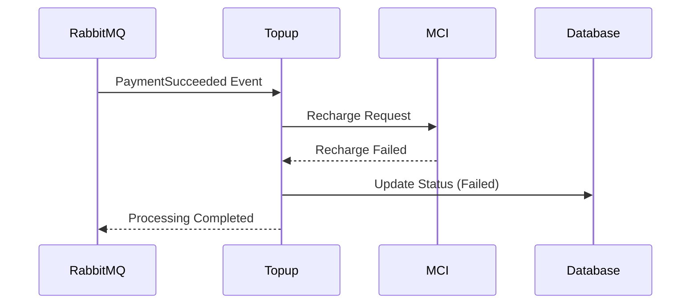

# Top-up Failed Sequence

## Overview

Recharge request is rejected by the mobile operator.

---

```mermaid
sequenceDiagram

    participant RabbitMQ
    participant Topup
    participant MCI
    participant Database

    RabbitMQ->>Topup: PaymentSucceeded Event

    Topup->>MCI: Recharge Request

    MCI-->>Topup: Recharge Failed

    Topup->>Database: Update Status (Failed)

    Topup-->>RabbitMQ: Processing Completed
```

---

## Result

- Recharge Failed
- Failure Stored
