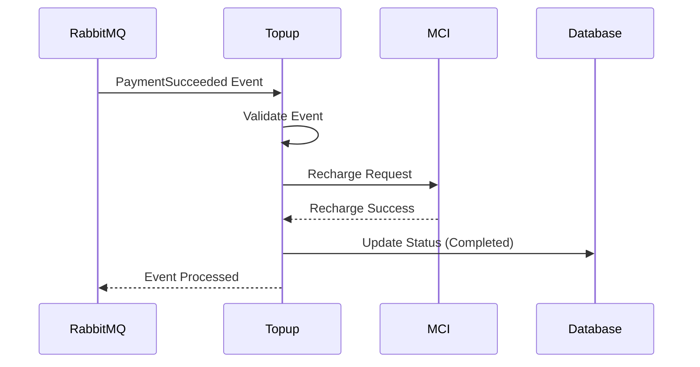

# Top-up Success Sequence

## Overview

Recharge is processed successfully after receiving the payment event.

---

```mermaid
sequenceDiagram

    participant RabbitMQ
    participant Topup
    participant MCI
    participant Database

    RabbitMQ->>Topup: PaymentSucceeded Event

    Topup->>Topup: Validate Event

    Topup->>MCI: Recharge Request

    MCI-->>Topup: Recharge Success

    Topup->>Database: Update Status (Completed)

    Topup-->>RabbitMQ: Event Processed
```

---

## Result

- Recharge Completed
- Status Updated
