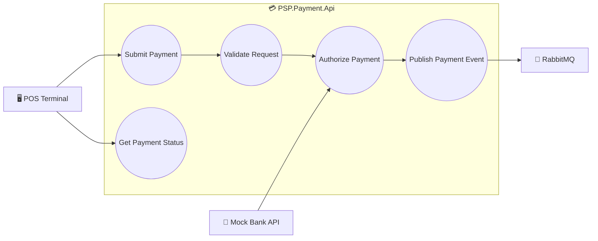

# Payment Use Case

## Overview

This diagram illustrates the responsibilities of the **Payment Service** within the PSP platform.

The service is responsible for receiving payment requests, validating them, communicating with the Bank API, and publishing successful payment events.

---

## Actors

- POS Terminal
- Bank API
- RabbitMQ

---

## Use Case Diagram

---

## Description

### Submit Payment

Receives a payment request from the POS terminal.

---

### Validate Request

Validates:

- Amount
- Phone Number
- Merchant Information
- Request Integrity

---

### Authorize Payment

Calls the external Bank API to authorize the payment.

---

### Publish Payment Event

Publishes a successful payment event to RabbitMQ for downstream processing.

---

### Get Payment Status

Returns the current payment status.
