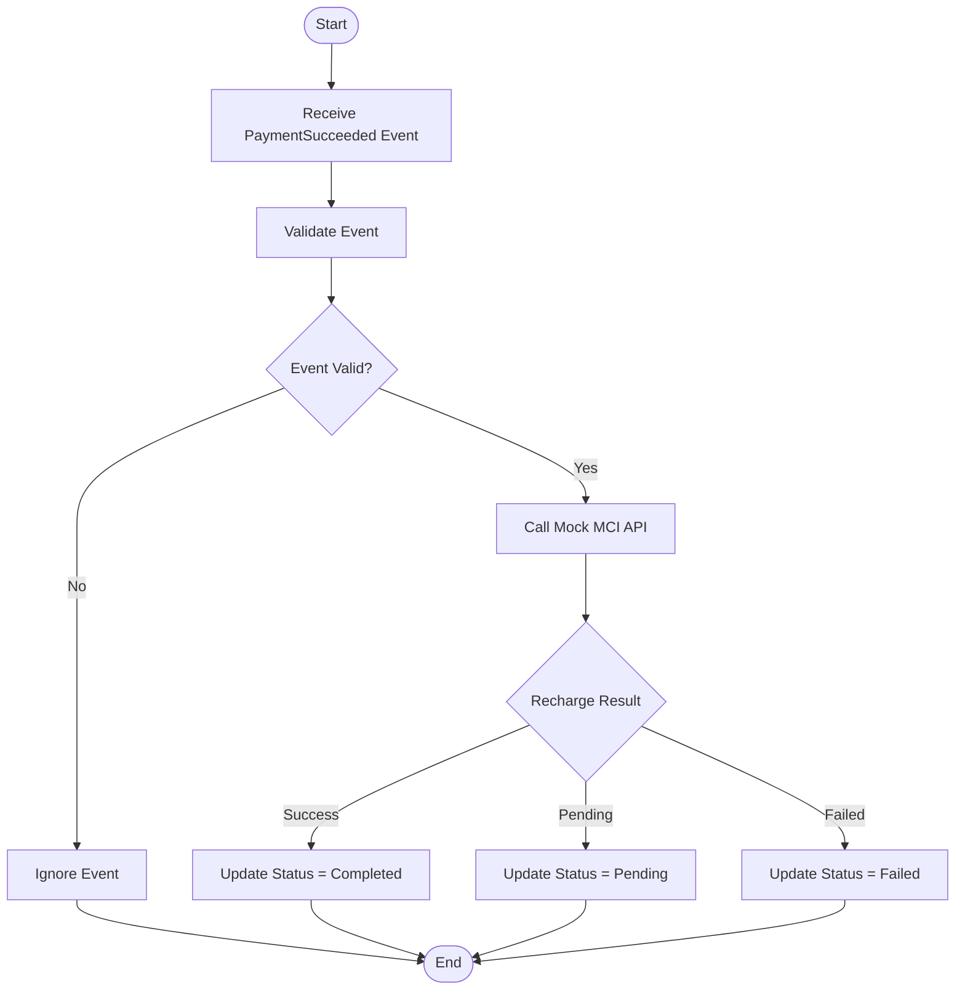

# Top-up Activity Diagram

## Overview

This activity diagram describes the recharge workflow executed by the Top-up Service.

The process begins after a successful payment event is received from RabbitMQ.

---

## Activity Diagram

---

## Business Rules

- Only successful payment events are processed.
- Invalid events are ignored.
- The Mobile Operator may return:
  - Success
  - Pending
  - Failed
- The recharge status is updated according to the operator response.
